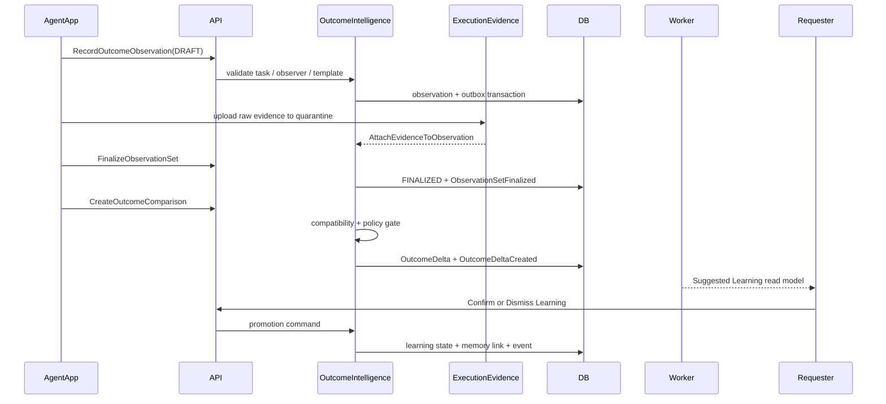

# Proxy Outcome Intelligence Architecture R3

**状态**：APPROVED IMPLEMENTATION CONTRACT  
**基线**：Prototype v1.5.2 · Chapter 21D R3 FINAL · P0 Addendum R3 FINAL ALIGNED  
**模块**：`OutcomeIntelligence`

本文件把 Outcome Data / Before-After / Learning 从原型行为收敛为可编码的 Domain 边界。HTML 原型只表达交互和状态；Domain、数据库和 API 才是最终授权与事实来源。

## 1. 模块责任

`OutcomeIntelligence` 负责：

```text
ObservationTemplate
ObservationSet
OutcomeObservation
OutcomeDelta
OutcomeLearning
BusinessOutcomeHistory projection
AgentOutcomeCapabilitySummary projection
```

不负责：

```text
Raw EvidenceAsset 的所有权       → ExecutionEvidence
Requester Satisfaction            → Satisfaction / Recovery
Hard Requirement / Eligibility    → Demand / Policy
Agent Capability Verification     → Capability / Policy，消费 Outcome evidence
Venue / Store canonical identity → Principal / Business
```

跨模块只能使用 typed command、ID/ref、Domain Event 或经过批准的 Read Model，不能直接写其他模块的表。

## 2. 严格数据边界

```text
EvidenceAsset
  └─ raw media / checklist / timestamp；受 retention policy 控制

OutcomeObservation
  └─ 结构化事实或 Agent assessment；绑定 Task / Order / Template / Observer

OutcomeDelta
  └─ 两个 FINALIZED ObservationSet 的可审计比较

RequesterSatisfaction
  └─ Requester 对结果的主观评价、Recovery 和 Repeat 意图
```

禁止：

- 用照片之间的视觉差异直接生成 OutcomeDelta；
- 把 Agent Assessment 存成 Objective Fact；
- 把 Satisfaction 覆盖 Objective Outcome；
- 把 Suggested Learning 静默变成 Hard Requirement、Eligibility、Safety 或 Cash Eligibility；
- 把 Outcome Observation 形成公开 People Content；
- 因为 Raw Evidence 被删除，就向用户表述结构化 Outcome 一并被删除。

## 3. Canonical Ownership 与状态机

### 3.1 ObservationTemplate

由 `OutcomeIntelligence` 持有版本。Business Workspace 只能在授权 scope 内创建/发布模板版本。

```text
DRAFT → ACTIVE → RETIRED
```

Template version 至少包含：

```text
template_id
version
scenario_id
role_id
observation_targets[]
evidence_requirements[]
comparison_policy_version
retention_policy_id
status
```

每个 target 必须定义：

```text
target_id
observation_type: OBJECTIVE_FACT | AGENT_ASSESSMENT
value_type: NUMERIC | ORDINAL | STATE
unit / scale
required
allowed_evidence_types[]
comparison direction / rank / compatibility
privacy_constraints[]
```

### 3.2 ObservationSet

一个 Task-bound、Template-bound 的观察集合。

```text
DRAFT
  → FinalizeObservationSet
FINALIZED
```

规则：

- DRAFT 可以 Record / Attach / 修正观察；
- FINALIZED 后旧集合不可直接 mutate；修正必须创建新 revision；
- `CreateOutcomeComparison` 只接受 FINALIZED baseline 与 FINALIZED result；
- Finalize 与 Create Comparison 必须是两个独立 command 与 event；
- `FinalizeObservationSet` 必须记录 actor、时间、template version、policy snapshot。

### 3.3 OutcomeLearning

```text
SUGGESTED
  ├─ ConfirmOutcomeLearning → CONFIRMED
  ├─ DismissOutcomeLearning → DISMISSED
  └─ EXPIRE policy → EXPIRED

CONFIRMED
  └─ DeleteRequesterOutcomeMemory → memory inactive / deleted
```

只有 `CONFIRMED` 可以进入 Requester Memory 的未来默认建议。即使 Confirmed，也不能绕过下一次 Requester confirmation 或 Material Change。

## 4. Domain Comparison Gate

`CreateOutcomeComparison` 的 handler 必须按以下顺序校验：

```text
load baseline ObservationSet
load result ObservationSet
→ both status = FINALIZED
→ same comparison target / target_id
→ compatible template lineage
→ same venue / store / comparison_entity_id
→ compatible unit / ordinal scale / state vocabulary
→ comparison policy exists and is active
→ freeze comparison_policy_version
→ derive comparison_result
→ persist OutcomeDelta + provenance + event
```

任何兼容性不能证明的情况都不能生成伪造 Delta：

```text
incompatible identity / lineage / entity / unit
→ reject CreateOutcomeComparison

compatible observations but missing / unmappable value
→ comparison_result = UNKNOWN
```

结果只允许：

```text
IMPROVED | WORSE | SAME | UNKNOWN
```

绝不能使用通用规则“值变化 = IMPROVED”。比较方向属于 Template policy，而不是 UI helper。

### P0 Restaurant policy

```text
queue_wait_minutes:
  NUMERIC · LOWER_BETTER · unit=min

english_menu_available:
  STATE_CHANGE · MISSING < AVAILABLE

greeter_present:
  STATE_CHANGE · MISSING < PRESENT

restroom_cleanliness:
  ORDINAL 1–5 · HIGHER_BETTER

food_presentation:
  ORDINAL 1–5 · HIGHER_BETTER
```

## 5. Commands / Events / Read Models

### Commands

```text
CreateObservationTemplateVersion
RecordOutcomeObservation
AttachEvidenceToObservation
FinalizeObservationSet
CreateOutcomeComparison
ConfirmOutcomeLearning
DismissOutcomeLearning
DeleteRequesterOutcomeMemory
```

所有 command 必须使用 canonical envelope：

```text
command_id
command_type / command_version
actor
principal
target
idempotency_key
expected_aggregate_version
policy_snapshot
purpose
correlation_id / causation_id
payload
```

### Events

```text
ObservationTemplateVersionCreated
OutcomeObservationRecorded
ObservationEvidenceAttached
ObservationSetFinalized
OutcomeDeltaCreated
OutcomeLearningSuggested
OutcomeLearningConfirmed
OutcomeLearningDismissed
OutcomeMemoryDeleted
EvidenceRetentionExpired
```

Event consumer 必须有 inbox / dedupe；重复事件不能重复升级 Memory、重复创建 Delta 或重复触发通知。

### Read Models

```text
TaskOutcomeSummary
BeforeAfterComparison
BusinessOutcomeHistory
RecurringIssueSummary
AgentOutcomeCapabilitySummary
RequesterOutcomeMemorySummary
```

Read Model 必须带：

```text
model_version
as_of
freshness
aggregate_refs
allowed_actions
redactions
```

Read Model 只能展示已授权事实，不能反向成为 Domain Truth 或写入授权来源。

## 6. Persistence Boundary

建议 PostgreSQL `outcome` schema：

```text
observation_templates
observation_template_targets
observation_sets
outcome_observations
observation_evidence_refs
outcome_deltas
outcome_learnings
outcome_memory_links
outcome_policy_snapshots
```

关键约束：

- `observation_set_id + target_id` 在同一 revision 内唯一；
- FINALIZED ObservationSet 不允许普通 UPDATE；
- OutcomeDelta 唯一绑定 baseline/result/policy version；
- `comparison_policy_version` 必须持久化，不能运行时重新推导历史结果；
- 所有写入与 OutboxMessage 在同一 transaction；
- `principal_id`、`task_id`、`observer_id`、`venue/entity` 必须可审计；
- Raw Evidence 只保存短期受控引用，结构化 Observation 的 provenance 独立保存。

## 7. API Boundary

```text
POST /v1/commands/CreateObservationTemplateVersion
POST /v1/commands/RecordOutcomeObservation
POST /v1/commands/AttachEvidenceToObservation
POST /v1/commands/FinalizeObservationSet
POST /v1/commands/CreateOutcomeComparison
POST /v1/commands/ConfirmOutcomeLearning
POST /v1/commands/DismissOutcomeLearning
POST /v1/commands/DeleteRequesterOutcomeMemory

GET /v1/mobile/read-models/task-outcome-summary/{taskId}
GET /v1/mobile/read-models/before-after-comparison/{deltaId}
GET /v1/mobile/read-models/requester-outcome-memory/{principalId}
GET /v1/mobile/read-models/business-outcome-history/{businessId}
```

最终 URL 可按 API 总体规范调整，但 command semantics、idempotency、permission 和 domain gate 不得改变。

## 8. Runtime Flow



## 9. Agent Capability Boundary

订单数、五星、一次 Outcome 只能触发：

```text
Outcome Verification Review
```

不能直接产生：

```text
QUALIFIED → PROVEN
QUALIFIED → OUTCOME_VERIFIED
```

最终 `OUTCOME_VERIFIED` 由独立 Capability Verification Policy 生成，至少消费：

```text
policy threshold
evidence quality
compatible task context
useful outcome count
anti-gaming result
requester / business verification where required
```

OutcomeIntelligence 只提供可审计事实和 Delta；不直接改写 Capability Passport 的 canonical verification status。

## 10. Implementation Order for Luna

```text
1. value objects + policy types
2. ObservationTemplate / ObservationSet aggregates
3. comparison compatibility service + policy evaluator
4. OutcomeDelta aggregate + persistence constraints
5. Learning promotion / dismiss / delete commands
6. outbox events + inbox dedupe
7. read models and redaction
8. REST/OpenAPI command endpoints
9. App screens: Template → Observation → Finalize → Delta → Learning
10. integration / concurrency / privacy tests
```

先完成 Domain tests，再做 App clickable flow。不能把 v1.5.2 HTML 的 local state 直接当成数据库模型。

## 11. Acceptance Matrix

| Contract | Domain test | API test | App test |
|---|---|---|---|
| DRAFT cannot compare | reject non-finalized set | `BUSINESS_STATE` | Delta CTA hidden/blocked |
| FINALIZED is immutable | reject direct update | correction requires revision | edit controls disappear |
| compatible comparison only | reject target/entity/unit mismatch | no Delta or UNKNOWN | explain blocked comparison |
| policy-versioned result | fixture per target direction/rank | version persisted | shows policy version |
| fact/assessment separation | schema invariant | provenance required | separate UI badges |
| raw/structured retention | retention owner test | no raw leakage | deletion copy is accurate |
| Learning promotion | confirm/dismiss/delete transitions | idempotent commands | all three actions visible |
| capability gate | order count alone rejected | policy decision auditable | Review, not Proven |

## 12. Exit Criteria

Outcome Intelligence 可以从“架构完成”进入 Luna 编码，当且仅当：

- 本文件与 Chapter 21D R3、P0 Addendum R3、Domain Gate 一致；
- Domain tests 覆盖所有 P0 transition / rejection；
- PostgreSQL migration 与 Outbox 已定义；
- API contract 与 Read Model 已进入 OpenAPI / shared contracts；
- App 不拥有 Delta 语义或最终权限；
- Chapter 25 相关 AC 有自动化测试映射。
