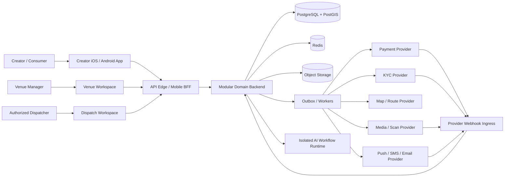
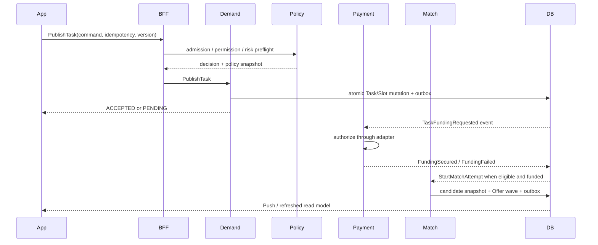
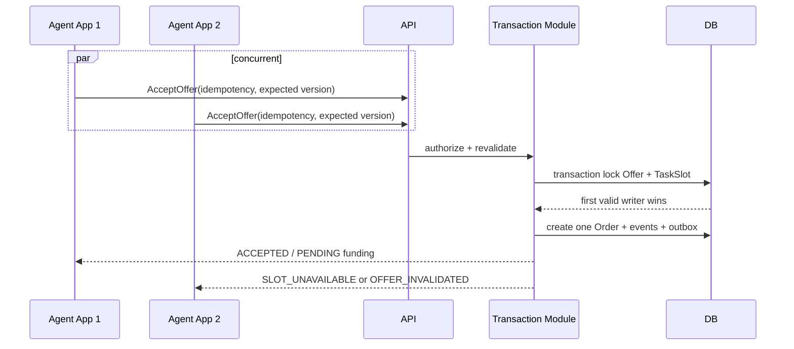
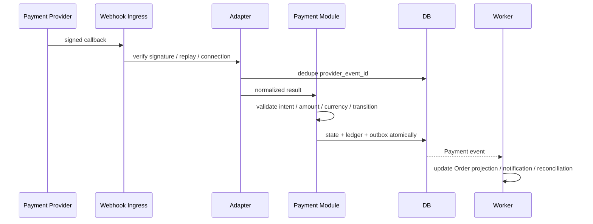
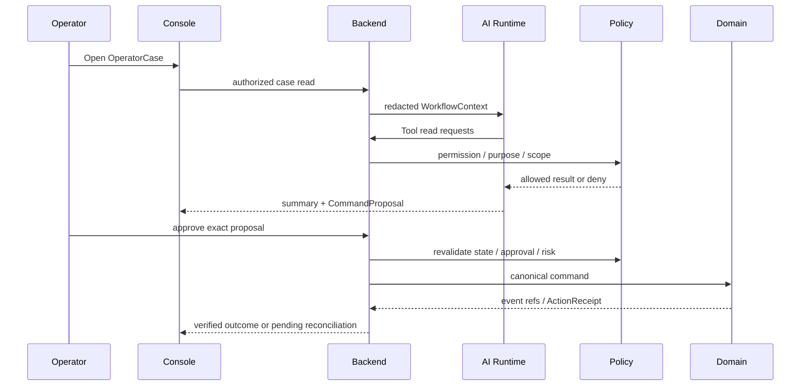
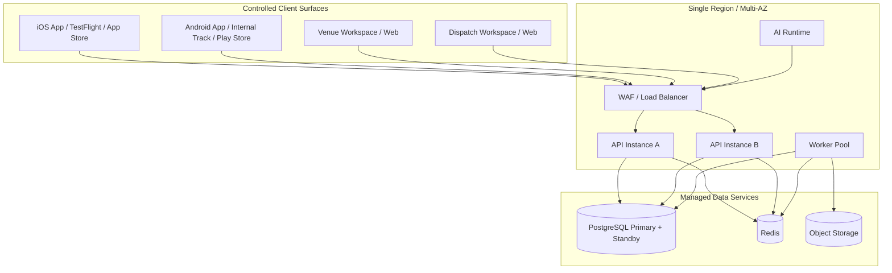

# Proxy System Architecture v1

**状态**：APPROVED BASELINE — Implementation Handoff  
**产品形态**：Creator iOS / Android App + Unified Venue/Dispatch Web；共同使用统一资源编排平台
**当前实现基线**：Prototype v1.5.2 · Chapter 21D R3 FINAL · P0 Addendum R3 FINAL ALIGNED  
**依据**：Proxy PRD v1.1 Chapter 01–41、Canonical Registry、Outcome Intelligence Architecture R3  
**目标**：把 PRD 的 Domain contract 收敛成 Luna 可直接实现、可测试、可演进的工程架构。

> 本文保留 v1 系统基线；Outcome Data / Before-After / Learning 的详细 Domain 边界以 [Proxy_Outcome_Intelligence_Architecture_R3.md](./Proxy_Outcome_Intelligence_Architecture_R3.md) 为准。HTML 原型不是 backend authorization layer。

---

# 1. 架构结论

P0 采用：

```text
一个 Creator iOS / Android App
+
一个 Unified Orchestration Web
  ├── Venue Workspace
  └── Dispatch Workspace
+
一个模块化单体 Backend
+
PostgreSQL / PostGIS 单写事实库
+
Redis 非权威缓存与限流
+
Object Storage 受控媒体存储
+
Transactional Outbox + Worker
+
Provider Adapters
+
隔离的 AI Workflow Runtime
```

核心判断：

- Creator App 是内容、撮合、现场执行与个人供给入口，不承载复杂场所经营或全局调度。
- Venue Workspace 面向场所管理者；Dispatch Workspace 面向受控专业调度人员。两者共享 Web 工程和设计系统，但路由、权限、Read Model 与审计范围隔离。
- P0 不建设独立 Venue 原生 App。场所预约、需求呼叫和供给管理优先使用响应式 Web / PWA / QR / 分享链接。
- App 与 Web 都是壳；Human、Venue、Space、Availability、Demand、Offer、Assignment、Reservation、Outcome 与 Economic truth 只属于统一资源编排平台。
- 用户/Creator、Venue member、Dispatcher 是显式 Principal Context；客户端选择永远不能替代服务端授权。
- P0 不拆微服务；模块化单体减少分布式一致性风险，同时保留未来拆分边界。
- PostgreSQL 是 Order、TaskSlot、Payment、Ledger、KYC decision、Safety、Consent 与 Audit 的唯一事实库。
- Redis、Search index、Read Model、AI、Provider result 都不能成为 Domain truth。
- 所有写入都使用 Command；跨模块传播使用 Domain Event + Transactional Outbox。
- 不使用分布式事务；跨模块失败通过幂等、补偿和 reconciliation 处理。
- App 在弱网下可以读取缓存、编辑草稿和排队低风险动作；Accept Offer、Funding、Payment、Check-in、Safety、KYC、Payout 等高风险动作必须在线确认。
- AI 默认只读和生成 proposal；不能直接访问数据库或绕过 Domain Command。

---

# 2. Scope 与非目标

## 2.1 P0 Scope

Creator App：

```text
Account / Session / Recovery
Content / feed / discussion / posting
Market and scene visibility
Intent capture and semantic routing
Creator availability and invitation response
Assignment / reservation visibility
Check-in / evidence / execution outcome
Earnings / settlement visibility
Inbox / Push / Deep link
Safety / Incident / Support
Privacy / Consent / Account lifecycle
```

Unified Orchestration Web：

```text
Venue Workspace
  Venue / Space / Capacity / Schedule
  Reservation / Demand / Offer / execution confirmation
  Venue-scoped members, settlement visibility and scene policies

Dispatch Workspace
  Cross-venue gaps / conflicts / replacement
  Match rescue / safety / dispute / settlement review
  JIT cross-tenant access / dual control / audit timeline
```

## 2.2 P0 非目标

```text
Dedicated Venue native app
Separate Venue and Dispatch backends
Microservices
Kafka
Kubernetes
GraphQL federation
Multi-region active-active writes
Offline Accept / Payment / Check-in
AI autonomous money / KYC / Safety actions
Generic people search
Native live streaming
Full CRM / storefront / membership wallet
```

---

# 3. System Context



所有 Provider callback 都先进入验证、去重和 normalized adapter，再允许 Domain 做状态转换。

---

# 4. Mobile App Architecture

## 4.1 推荐技术基线

```text
React Native + TypeScript
Expo development build / prebuild workflow
React Navigation
TanStack Query for server state
Zustand for small client-only state
React Hook Form + schema validation
SQLite for approved non-secret local persistence
Keychain / Android Keystore for credentials
Sentry-compatible crash / performance telemetry
```

具体版本由实现启动日锁定，不使用浮动 `latest`。如果 Luna 发现某个设备能力要求 native module，可通过 Expo prebuild 加入，不改成 Web fallback。

选择 React Native 的原因：

- iOS / Android 共用主要业务代码；
- TypeScript 可与 API contract、validation schema 和测试 fixture 共享；
- Push、Deep Link、Camera、Media、Location、Secure Storage 均有成熟原生桥接路径；
- 团队可在需要时为高风险设备能力编写 Swift / Kotlin module；
- 不把 UI 与浏览器 DOM、SEO 或 responsive Web 假设绑定。

## 4.2 Creator App Shell

```text
AppShell
├── Bootstrap
│   ├── app version / forced upgrade
│   ├── environment config
│   ├── device registration
│   ├── secure session restore
│   └── remote capability flags
├── Authentication Stack
├── Creator / Consumer Context
├── Home Semantic Command Surface
├── Market / Feed / Messages / Me Tabs
├── Availability / Invitation / Execution Flows
├── Shared Inbox
├── Safety Entry
├── Deep Link Router
└── Global Offline / Pending / Restricted Banner
```

Principal 切换必须显式展示当前作用身份。Venue 与 Dispatch 工作区不通过 App 内的视觉切换获得权限；对应 command 必须携带服务端验证的 venue membership 或 dispatch scope。

## 4.3 Feature Modules

```text
features/
├── auth
├── account-security
├── principal
├── requester-home
├── task-builder
├── task-detail
├── agent-passport
├── availability
├── offers
├── orders
├── execution
├── evidence
├── outcome-intelligence
├── satisfaction
├── requester-memory
├── payments
├── earnings
├── business-workspace
├── inbox
├── safety
├── privacy
└── support
```

每个 feature 只能通过 typed API client 访问 Backend；不得直接拼 URL、复用其他 feature 的内部 store 或在 UI 中复制 Domain transition 规则。

## 4.4 State Ownership

| State | Owner | App 行为 |
|---|---|---|
| Domain state | Backend | TanStack Query cache；不可由 Zustand 伪造 |
| Session token | Keychain / Keystore | 不进入 AsyncStorage、日志或 analytics |
| Principal context | App session + Backend validation | 本地选择只是 hint，每次 command 服务端复核 |
| Draft form | Feature local state / SQLite | 可离线保存，发布时重新校验 |
| Read cache | TanStack Query persisted subset | 带 `as_of`、freshness、redaction |
| Pending low-risk action | Local operation queue | 有 TTL、idempotency、用户可取消 |
| High-risk action result | Backend / Provider | 不乐观伪造成功 |
| Feature flag | Signed remote config | 不能绕过 server Policy / Permission |

## 4.5 Offline / Weak Network Policy

允许离线：

- 读取最近一次已授权、已脱敏的非敏感 Read Model；
- 编辑 Task Draft；
- 编辑未提交 Profile / Capability Draft；
- 保存 Evidence upload draft；
- 生成本地待发送的低风险 feedback。

必须在线：

```text
login / recovery / step-up
principal membership change
publish task
start matching
accept / decline offer
funding / refund / payout
check-in / live location grant
submit final evidence
complete / cancel order
open / resolve safety action
KYC
consent withdrawal with immediate effect
account deletion / export
```

所有离线队列项必须带：

```text
operation_id
created_at
expires_at
principal snapshot
target
payload hash
idempotency key
required online revalidation
```

## 4.6 Device Capabilities

### Push

- App 保存 platform push token 的 scoped reference；Backend 保存 device registration。
- Push payload 只含安全摘要和 deep-link token，不含 D4 / D5、完整地址、KYC 或争议详情。
- 点击后 App 必须重新鉴权并读取最新 Read Model。
- Token rotation、logout、account restriction 和 device revoke 必须更新注册状态。

### Deep Link / Universal Link / App Link

- 所有 deep link 使用稳定 route id 和 opaque object ref。
- 路由前检查 session、principal、permission、resource ownership 和 current state。
- 无权限、过期或对象不存在时显示安全错误，不泄露对象存在性。

### Location

- 默认前台、purpose-bound、TTL-bound。
- P0 不持续后台追踪；只有执行窗口内经用户授权的场景才允许有限后台能力。
- 精确位置不进入普通 analytics、push 或日志。
- 匹配优先使用 coarse zone / ETA projection。

### Camera / Media

- 使用 OS permission 和 purpose explanation。
- 上传走 signed upload session；客户端不持有 Object Storage 长期凭证。
- 上传完成不等于 Evidence submitted；必须等待完整性、病毒/内容扫描和 Domain command。
- 本地敏感媒体完成上传后按 retention policy 清理临时副本。

### Secure Storage / App Integrity

- refresh token、device credential 使用 Keychain / Keystore。
- access token 短期有效；日志与 crash report 自动脱敏。
- 高风险动作可要求 biometric / device passcode step-up。
- 支持设备撤销、session revoke 和最低 App version gate。

## 4.7 Mobile API Interaction

App 使用 HTTPS REST/JSON。Query 与 Command 分离：

```text
GET /v1/mobile/read-models/{type}/{id}
POST /v1/commands/{command_type}
GET /v1/operations/{operation_id}
POST /v1/uploads
```

最终 URL 可调整，但以下语义不能改变：

- Command 使用 canonical envelope；
- Query 返回 `as_of`、freshness、allowed actions、redactions；
- 高风险写入带 idempotency key 和 expected aggregate version；
- `ACCEPTED`、`PENDING`、`ALREADY_APPLIED` 与 `REJECTED` 分离；
- App 只根据 server-provided `allowed_actions` 展示 CTA，但服务端仍必须重新授权。

---

# 5. Unified Venue/Dispatch Web

Unified Orchestration Web 推荐 React + TypeScript，由 Venue Workspace 与 Dispatch Workspace 组成。两者可以共享组件、API schema 和 design tokens，但必须使用不同路由边界、服务端权限、Read Model 与审计策略；不能通过前端隐藏菜单代替授权隔离。

Venue Workspace 必须具备：

```text
tenant / venue scoped session
Venue / Space / Capacity / Schedule management
Reservation / Demand / Offer / execution confirmation
venue membership and role validation
venue-scoped settlement visibility
append-only command and membership audit
no direct database access
```

Dispatch Workspace 必须具备：

```text
SSO / MFA
device / network policy where available
OperatorAccessGrant
JIT D4 / D5 access
case-bound purpose
field-level redaction
dual control
append-only OperatorAuditLog
no direct database access
```

两个 Workspace 都只能调用受控 BFF / canonical Domain Command。Venue command 必须绑定 tenant、venue 与 membership scope；任何调度“快速修复”都必须创建 Repair Command、ManualAdjustmentRequest、Approval 或 OperatorCase，不允许 SQL console 成为业务功能。

---

# 6. Backend Architecture

## 6.1 Deployment Units

P0 使用同一代码库、三个后端运行进程：

```text
api
worker
ai-runtime
```

Web 前端可作为一个部署单元、两个受控 Workspace：

```text
orchestration-web
  /venue/*
  /dispatch/*
```

`api` 与 `worker` 共享 Domain modules；`ai-runtime` 只能通过受控 Tool API 调用 Backend，不加载数据库凭证。

## 6.2 Recommended Backend Stack

```text
Go
standard library `net/http` API boundary
explicit Domain modules and ports
PostgreSQL + PostGIS
Redis
S3-compatible Object Storage
OpenAPI 3.1
JSON Schema / generated contract validation
OpenTelemetry
```

选择 Go 是为了让 Backend runtime、并发模型和部署保持简单可控。HTTP 层使用标准库，Domain logic 不依赖 HTTP；移动端仍使用 React Native + TypeScript，跨端契约通过 JSON Schema / OpenAPI 生成，不把 Go Domain entity 放入 App。

## 6.3 Modular Monolith Boundaries

| Module | Canonical write ownership | 关键依赖 |
|---|---|---|
| Identity | UserAccount、LoginIdentity、Session、Recovery | Risk、Notification |
| Principal | BusinessAccount、Membership、Principal context | Identity |
| CatalogGraph | Industry、Scenario、Role、Capability、Templates | Policy |
| Demand | Task、SlotGroup、TaskSlot、TaskNeedProfile | Catalog、Policy |
| Supply | AgentProfile、Availability、Location visibility | Identity、Graph、Privacy |
| MatchOffer | MatchAttempt、CandidateSnapshot、Offer、wave | Demand、Supply、Risk、Policy |
| Transaction | Quote、Order、CompensationTerms、Cancellation | Demand、Match、Payment |
| PaymentLedger | PaymentIntent、FundingHold、Refund、Payout、Ledger、Settlement | ProviderAdapter、Risk |
| ExecutionEvidence | ExecutionContext、Check-in、Evidence、ContactGrant、Exception | Order、Privacy、Media | 
| OutcomeIntelligence | ObservationTemplate、ObservationSet、OutcomeObservation、OutcomeDelta、OutcomeLearning | ExecutionEvidence、Business、Satisfaction、Privacy、Policy | 
| SatisfactionMemory | Requester Satisfaction、Recovery、Requester Outcome Memory、Repeat eligibility | Outcome、Order、Safety、Requester | 
| TrustSafety | Review、RiskDecision、Incident、SafetyBlock、Dispute、Appeal | Identity、Order、Payment | 
| NotificationInbox | NotificationEvent、Delivery、InboxItem、DeviceRegistration | all events |
| PrivacyLifecycle | Consent、PermissionGrant、Retention、LegalHold、Deletion、Export | Identity、all data owners |
| Operator | OperatorCase、JIT Grant、ManualAdjustmentRequest、Audit | all controlled commands |
| PolicyRuntime | PolicySet、PolicyDecision、Guardrail、Trace、Proposal | all command ingress |
| AIWorkflow | Profile、Workflow、Tool、Approval、DelegatedAction、Receipt | Operator、Policy、Tool API |
| ProviderAdapter | Payment、KYC、Geo、Media、Notification connections | owned Domain modules |

规则：

```text
one object = one write owner
no cross-module table writes
no cross-module ORM entity import
commands enter owning module
events cross modules
read projections may join approved facts
```

## 6.4 Internal Layers

每个 module 使用：

```text
domain/
  entities, value objects, policies, state transitions, domain events
application/
  commands, handlers, queries, ports, orchestration
infrastructure/
  repositories, provider adapters, projections
interface/
  http controllers, event consumers, DTO mapping
```

禁止把 state transition、金额计算、permission 或 idempotency 只写在 Controller、ORM hook、mobile client 或 Provider callback 中。

## 6.5 CQRS-lite

写入路径：

```text
HTTP Command
→ Authentication / Principal Guard
→ Policy / Permission Preflight
→ Command Handler
→ Load Aggregate + Version
→ Validate Invariant
→ Atomic Mutation
→ Append Domain Event + Outbox
→ Commit
→ Command Result
```

读取路径：

```text
Query
→ Authentication / Principal / Purpose
→ Read Model Repository
→ Field Redaction
→ allowed_actions calculation
→ freshness envelope
```

P0 不做完整 Event Sourcing。Aggregate 当前状态保存在业务表，Domain Event / Outbox 保存可重放的事实与集成记录。

---

# 7. Data Architecture

## 7.1 Primary Stores

| Store | 用途 | 不得承担 |
|---|---|---|
| PostgreSQL | canonical state、transaction、ledger、audit、outbox | raw media blob |
| PostGIS | geo zone、距离/范围查询、coarse location | unrestricted live tracking |
| Redis | rate limit、short cache、distributed coordination、short-lived reservation hint | Order/Payment/Ledger truth |
| Object Storage | media、evidence raw、restricted provider payload、exports | object state machine |
| Read projections | App / Console 查询 | authorization source for mutation |

## 7.2 Database Layout

单一 PostgreSQL cluster，按 module 使用 schema：

```text
identity
principal
catalog
demand
supply
match_offer
transaction
payment
execution
safety
notification
privacy
operator
policy
ai_workflow
integration
audit
outcome
satisfaction
```

所有表至少包含：

```text
id
version where aggregate
created_at UTC
updated_at UTC
created_by / updated_by where material
market_id / tenant_id where scoped
data_class where sensitive
```

金额：integer minor units + ISO currency；禁止 float。时间：数据库 UTC，UI 按 Market / device timezone 显示。ID：UUIDv7 或 ULID，全局不可猜测；最终选择在建仓时统一。

## 7.3 Transactional Outbox

Aggregate mutation 与 OutboxMessage 必须同一数据库事务提交。Worker 使用 inbox/dedupe 处理事件；不依赖 exactly-once delivery。

```text
PENDING → PROCESSING → SENT
                   ↘ FAILED → RETRY → DEAD_LETTER
```

Money、Safety、Consent、Account revoke 的 dead letter 是阻塞级告警并创建 OperatorCase。

## 7.4 Ledger

- Ledger entry append-only。
- 所有 debit / credit 总和必须平衡。
- Payment provider status 与 Ledger fact 分离。
- Manual adjustment 必须 request → second approval → post。
- 不允许 update/delete 已记账 entry；修正使用 reversal / adjustment entry。
- 每个 provider operation 有唯一 idempotency 与 reconciliation reference。

## 7.5 Media / Evidence

```text
CreateUploadSession
→ signed short-lived upload URL
→ upload to quarantine prefix
→ integrity / virus / content scan
→ MediaReady event
→ SubmitEvidence command
→ retention binding
```

未经扫描或 hash 不匹配的文件不能成为 Evidence。Object key 不直接暴露给 App，下载使用短期、purpose-bound URL。

## 7.6 Data Retention

Retention job 只能生成 deletion proposal；各 Domain owner 根据 LegalHold、financial、safety、fraud 和 audit exception 执行。删除需记录 tombstone / completion evidence，但不能保留已删除 raw personal data 的副本。

---

# 8. Critical Runtime Flows

## 8.1 Publish Task and Start Matching



Task、Slot、funding 与 matching 状态分别由 owner 持有，不以一个巨大 status 替代。

## 8.2 Concurrent Accept



唯一性由 PostgreSQL transaction、row lock / conditional update、unique constraint 和 aggregate version 共同保证；Redis lock 不能成为正确性前提。

## 8.3 Payment Callback



Timeout unknown result 进入 polling / reconciliation，不能盲目重复扣款。

## 8.4 Execution and Completion

```text
Online CheckInOrder
→ validate assigned Agent / time / geo / permission
→ ExecutionContext checked-in
→ temporary contact/location grant
→ upload evidence to quarantine
→ scan + MediaReady
→ SubmitEvidence
→ requester/system completion policy
→ CompleteOrder
→ payout eligibility evaluation
→ ReleasePayout command
→ provider result + ledger + settlement
```

Evidence 完成、Order 完成、Payout 可释放和 Payout 已支付是四个不同事实。

## 8.5 Outcome Intelligence / Satisfaction / Repeat

Outcome 不从两张照片直接推导，也不与 Satisfaction 合并。执行完成后：

```text
RecordOutcomeObservation
→ AttachEvidenceToObservation
→ FinalizeObservationSet
→ CreateOutcomeComparison
→ OutcomeDelta
→ Suggested Learning
→ Requester Confirm / Dismiss
→ Confirmed Memory / Repeat eligibility
```

`CreateOutcomeComparison` 必须由 `OutcomeIntelligence` Domain handler 执行以下 gate：

```text
both ObservationSet = FINALIZED
same target
compatible template lineage
same venue / store / comparison entity
compatible unit / scale / state vocabulary
comparison policy exists
comparison_policy_version frozen on OutcomeDelta
```

不兼容时拒绝生成 Delta；兼容但值缺失或不可映射时，结果只能是 `UNKNOWN`。结果不能由 App helper、Read Model、AI 或 Provider 直接决定。

只有 `CONFIRMED` Learning 可以影响未来默认建议；不能自动成为 Hard Requirement、Eligibility、Safety 或 Cash Eligibility。`NOT_ACHIEVED` 或 Recovery 未 `RESOLVED / WAIVED` 时，Repeat 必须隐藏。

## 8.6 Safety Stop

Safety command 使用最高优先级容量。创建 Incident / SafetyBlock 后，通过事件通知 Match、Transaction、Execution、Payment 和 Notification；各 owner 应用自己的 hold / restriction。Safety service 不直接改写 Ledger 或 Order 历史。

## 8.7 AI-assisted Operator Flow



AI Runtime 无数据库凭证、无任意 HTTP、无 shell、无 Provider secret。高风险动作只能 proposal + human approval。

---

# 9. API and Contract Architecture

## 9.1 API Surfaces

```text
/v1/mobile/*       App query / bootstrap / upload session
/v1/commands/*     canonical commands
/v1/operations/*   async operation status
/v1/operator/*     internal console, separate auth policy
/v1/providers/*    authenticated webhooks only
/v1/ai-tools/*     allowlisted internal tool API
```

Mobile 与 Operator 可以调用同一 Domain command，但 ingress policy、actor type、purpose、field visibility 和 approval 必须不同。

## 9.2 Authentication

- App：OTP/passwordless baseline；access + rotating refresh token；device registration。
- Sensitive command：recent authentication / step-up。
- Operator：Enterprise SSO + MFA + JIT OperatorAccessGrant。
- Provider：signature / mTLS / scoped credential，按 Provider contract。
- AI Runtime：workload identity + tool-specific permission，不使用用户 token impersonation。

## 9.3 Versioning

- URL major version：`/v1`。
- Command/Event/Read Model 内部保留独立 schema version。
- Additive optional field 可兼容；enum 新值必须 consumer review。
- 破坏性变更使用新 schema / endpoint，并提供 migration window。
- App 最低支持版本由 signed config 和 Backend compatibility matrix 决定。

## 9.4 OpenAPI and Generated Client

Backend 生成 OpenAPI 3.1；App 与 Operator 从契约生成 typed client。业务代码不能手写重复 DTO。CI 必须检查 breaking contract change、unknown enum handling 和 example fixture。

---

# 10. Security and Privacy Architecture

## 10.1 Trust Boundaries

```text
Mobile device = untrusted client
Operator browser = authenticated but not trusted for authorization
Provider callback = untrusted until verified
AI model / retrieval / tool output = untrusted input
Redis / read projection = non-authoritative
PostgreSQL owner transaction = canonical mutation boundary
```

## 10.2 Server-side Authorization

每次 command / sensitive query 重新计算：

```text
actor
session / device
account status
principal membership
resource ownership
KYC / capability
risk / restriction
consent / permission
purpose
data class
Operator grant
policy version
TTL / freshness
```

## 10.3 Data Classification

- D0/D1：可公开或低敏业务摘要，仍需 scope。
- D2/D3：Profile 与 transaction 数据，tenant / purpose bound。
- D4：精确位置、执行轨迹、私密 Evidence，短 TTL、逐次授权。
- D5：KYC、Government ID、Bank/Payout identity、credential，隔离存储与审计。

日志、event、analytics、push 与 crash report 默认不能复制 D4/D5 raw data。

## 10.4 Abuse Controls

- OTP、login、search、task publish、offer、chat、upload、refund、KYC 有独立 rate limit。
- Generic people browsing 永久禁止。
- Candidate API 只能由有效 Task + finite candidate snapshot 进入。
- Sensitive access 必须 case-bound、purpose-bound、TTL-bound。
- 所有 permission deny、cross-tenant attempt、secret serialization attempt 进入 security metric / alert。

---

# 11. Reliability and Operations

## 11.1 Initial SLO Targets

| Flow | Target |
|---|---|
| Authenticated read API | p95 ≤ 500 ms excluding Provider |
| Normal command acknowledgement | p95 ≤ 800 ms excluding async Provider |
| AcceptOffer atomic decision | p95 ≤ 1 s under planned load |
| Push creation after event | p95 ≤ 10 s |
| Read projection freshness | p95 ≤ 5 s for marketplace mainline |
| Money/Safety outbox lag | p95 ≤ 5 s; dead letter = blocker |
| App crash-free sessions | ≥ 99.5% initial target |
| API availability | ≥ 99.9% initial target |

这些是 implementation planning target，不覆盖 Provider SLA，也不构成未经 Pilot 验证的商业承诺。

## 11.2 Timeouts and Retries

- Query 可有限安全 retry。
- Command retry 必须复用 idempotency key。
- Provider mutation timeout 先标 `UNKNOWN`，再 query/reconcile。
- Mobile foreground request 不等待长任务；返回 operation id。
- Worker retry 有指数退避、次数上限、dead letter 和 owner。

## 11.3 Backpressure

优先级：

```text
W0 Safety / Money / Session revoke
W1 Marketplace commands
W2 Execution
W3 KYC / Account
W4 Read projection / Notification
W5 Analytics / Batch
```

过载时先暂停 W5、降低非关键通知和新 matching，不丢弃 Money、Safety、Consent、Audit 或 Ledger event。

## 11.4 Backup / DR

P0 为单 Region、多可用区：

- Managed PostgreSQL multi-AZ + PITR；
- Object Storage version / lifecycle；
- encrypted backup；
- restore drill；
- Read Model 可重建；
- Provider operation reconciliation；
- Region failover 初期为人工受控，不自动双写。

---

# 12. Deployment Architecture



环境：

```text
local
development
staging
production
```

Staging 使用 Provider sandbox、独立数据库与独立 secrets。Production 数据不得复制到 development；测试 fixture 使用合成/脱敏数据。

## 12.1 CI/CD

Backend pipeline：

```text
lint
→ typecheck
→ unit
→ domain invariant tests
→ integration / database tests
→ contract compatibility
→ build image
→ security / dependency scan
→ migrate staging
→ smoke / E2E
→ approved production rollout
```

App pipeline：

```text
lint / typecheck
→ unit / component
→ generated client compatibility
→ native build
→ device smoke tests
→ signed artifact
→ TestFlight / Play internal
→ staged store rollout
```

Database migration 必须 backward compatible、可观测、可重跑；不在 App release 中隐式依赖瞬时 schema cutover。

---

# 13. Observability

## 13.1 Correlation

从 App 的 operation reference 必须能追踪：

```text
mobile route / app version
session / principal safe ref
command id
aggregate id / version
event id
outbox id
worker attempt
provider request / callback
read projection
notification delivery
operator / AI action receipt
```

## 13.2 Telemetry

- Metrics：command、error、latency、queue lag、projection lag、Provider、App crash、push、security deny。
- Logs：结构化、redacted、correlation id；禁止 secret / raw D4 / D5。
- Traces：API → handler → DB → outbox → worker → Provider。
- Audit：业务审计单独 append-only，不以普通日志替代。

## 13.3 Release Blockers

```text
duplicate Order / Slot oversell
unbalanced Ledger
duplicate money side effect
signature-invalid callback accepted
cross-tenant access success
raw secret / D5 serialization
expired session / operator grant accepted
money / safety / consent outbox dead letter
high-risk offline mutation
AI tool bypass
```

---

# 14. Testing Architecture

## 14.1 Test Pyramid

```text
Domain unit and state-machine tests
Repository / PostgreSQL integration tests
Command / Event contract tests
Provider adapter sandbox tests
Worker idempotency / replay tests
Mobile component and navigation tests
Device capability tests on iOS / Android
Critical E2E flows
Fault injection / reconciliation drills
Security / permission / privacy tests
AI tool / approval / injection tests
```

## 14.2 Mandatory Concurrency Tests

- two Agents accept one Slot；
- duplicate command with same/different payload；
- payment callback before/after API timeout；
- cancel versus complete；
- evidence submit versus account restriction；
- session revoke during high-risk command；
- consent withdrawal versus D4 read；
- worker replay after crash；
- AI approval expires before execute。

## 14.3 Mobile-specific Tests

- cold start from push；
- deep link with wrong principal；
- token refresh during command；
- offline draft recovery；
- network loss after command sent；
- upload background/foreground transition；
- location permission denied / reduced accuracy / expired；
- camera/media permission denied；
- app upgrade with local schema migration；
- device revoked while App is active。

---

# 15. Evolution Strategy

模块只有满足以下条件才拆为独立 service：

```text
independent scaling need
independent security / data boundary
independent deployment cadence
clear owner and SLO
stable command / event contract
measured modular-monolith bottleneck
operational capacity to run the service
```

优先候选：Notification worker、Media pipeline、Matching compute、AI Runtime、Provider adapters。Payment/Ledger、Order/Slot 和 Identity 在没有完整 fencing、reconciliation、contract test 之前不优先拆分。

引入 Kafka、Kubernetes、Elastic/OpenSearch 或 multi-region writes 必须有真实吞吐、检索或隔离证据；不能以“未来可能规模大”为理由提前增加系统复杂度。

---

# 16. Open Decisions Before Production

这些不阻塞 Luna 建立骨架，但在接入真实 Provider / 上线前必须确定：

| Decision | Owner | Deadline |
|---|---|---|
| 首发国家、Metro、币种、时区 | Product / Legal / Operations | Provider integration 前 |
| Payment / Payout Provider | Finance / Engineering / Legal | Payment sandbox 前 |
| KYC Provider 与 required tier | Safety / Legal / Engineering | KYC sandbox 前 |
| Push / SMS / Email Provider | Product / Engineering | Notification E2E 前 |
| Map / route Provider | Product / Privacy / Engineering | Matching geo E2E 前 |
| Media storage / scan Provider | Security / Engineering | Evidence E2E 前 |
| Cloud / region / residency | Security / Legal / Engineering | Staging infrastructure 前 |
| App Store account / signing ownership | Business / Engineering | Device distribution 前 |
| React Native / Go exact versions | Engineering | repository bootstrap |

未决定项必须使用 adapter 和 config placeholder；Luna 不得在 Domain module 中硬编码供应商或市场规则。

---

# 17. Implementation Order

```text
0. Monorepo / CI / local infrastructure / generated contracts
1. Identity / Session / Principal / App Shell
2. Catalog / Graph / Policy snapshot
3. Task Draft / TaskSlot / Publish
4. Agent Passport / Availability
5. Matching / Offer / concurrent Accept / Order
6. Payment sandbox / Ledger / reconciliation
7. Execution / Location / Evidence / Completion
8. Outcome Intelligence / Satisfaction / Recovery / Memory / Repeat gate
9. Notification / Inbox / Deep Link
10. Safety / Operator Case / Privacy lifecycle
11. Business workspace
12. AI-assisted Operator in read-only + proposal mode
13. Pilot hardening / store distribution / launch gate
```

每一阶段必须形成一条可运行的 App 垂直链路，而不是先把所有数据库表和空 Controller 全部铺开。

---

# 18. Final Architecture Lock

```text
Proxy = Mobile App-first
Public product = iOS / Android App
Operator = internal desktop Console only
Backend P0 = modular monolith
Canonical writes = PostgreSQL owner transaction
Cross-module = Domain Event + Outbox
Mobile read = freshness-aware Read Model
Mobile mutation = typed Command + idempotency + revalidation
Provider = isolated Adapter + receipt + reconciliation
AI = isolated proposal / tool runtime, no direct DB authority
Money / Safety / KYC / Privacy / Ledger = fail closed
```

如果代码实现与本文件、Canonical Registry 或 Chapter 25/26 的 invariant 冲突，以 Canonical Domain truth 和 invariant 为最高优先级，并先提交 ADR / Registry change，不允许 Luna 在代码中自行发明替代状态或捷径。
